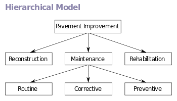
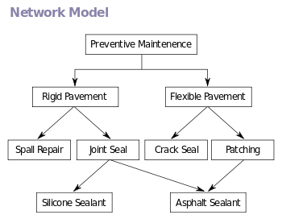
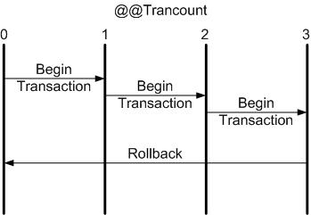
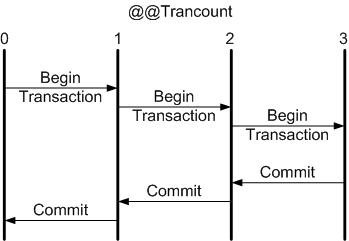

# Database Systems - Overview

#  What database models do you know?
  
   * **Hierarchical (tree)** - In a hierarchical model, data is organized into a tree-like structure, implying a single parent for each record. A sort field keeps sibling records in a particular order (structure like XML document).This structure allows one one-to-many relationship between two types of data. 
   
   

   * **Network / graph** - The network model expands upon the hierarchical structure, allowing many-to-many relationships in a tree-like structure that allows multiple parents.The network model organizes data using two fundamental concepts, called records and sets.Records contain fields. Sets define one-to-many relationships between records

   
   
   * **Relational (table)** - The relational model was introduced as a way to make database management systems more independent of any particular application. Three key terms are used extensively in relational database models: relations, attributes, and domains.A relation is a table with columns and rows. The named columns of the relation are called attributes, and the domain is the set of values the attributes are allowed to take. The basic data structure of the relational model is the table, where information about a particular entity is represented in rows and columns.

   

   * **Object-oriented**

#  Which are the main functions performed by a Relational Database Management System (RDBMS)?

    **RDBMS systems typically implement:**

 >   - Creating / altering / deleting tables and relationships between them (database schema)
 >  - Adding, changing, deleting, searching and retrieving of data stored in the tables
 >  - Support for the SQL language
    
#  Define what is "table" in database terms.
 
>	- Database tables consist of data, arranged in rows and columns
>	- All rows have the same structure
>   - Columns have name and type (number, string, date, image, or other)

#  Explain the difference between a primary and a foreign key.
    
> The one thing that primary, unique, and foreign keys all have in common is the fact that each       type of key can consist of more than just one column from a given table. In other words,        foreign, primary, and unique keys are not restricted to having just one column from a   given  table – each type of key can cover multiple columns. So, that is one feature that all the   
 different types of keys share – they can each be comprised of more than just one column, 
 which is something that many people in software are not aware of. 
 Foreign keys are used to reference unique columns in another table. So, for example, a foreign key can be defined on one table A, and it can reference some unique column(s) in another table B.
A table can have multiple unique and foreign keys. However, a table can have only one primary key.

#  Explain the different kinds of relationships between tables in relational databases.

   **There are three types of relationships:**

    One-to-one: Both tables can have only one record on either side of the relationship. Each primary key value relates to only one (or no) record in the related table. They're like spouses—you may or may not be married, but if you are, both you and your spouse have only one spouse. Most one-to-one relationships are forced by business rules and don't flow naturally from the data. In the absence of such a rule, you can usually combine both tables into one table without breaking any normalization rules.
    One-to-many: The primary key table contains only one record that relates to none, one, or many records in the related table. This relationship is similar to the one between you and a parent. You have only one mother, but your mother may have several children.
    Many-to-many: Each record in both tables can relate to any number of records (or no records) in the other table. For instance, if you have several siblings, so do your siblings (have many siblings). Many-to-many relationships require a third table, known as an associate or linking table, because relational systems can't directly accommodate the relationship.

#  When is a certain database schema normalized?
  * What are the advantages of normalized databases?

**Normalization of Database**

Database Normalisation is a technique of organizing the data in the database. Normalization is a systematic approach of decomposing tables to eliminate data redundancy and undesirable characteristics like Insertion, Update and Deletion Anamolies. It is a multi-step process that puts data into tabular form by removing duplicated data from the relation tables.

> Normalization is used for mainly two purpose,
Eliminating reduntant(useless) data.Ensuring data dependencies make sense i.e data is logically stored.

**Normalization rule are divided into following normal form.**

    First Normal Form - As per First Normal Form, no two Rows of data must contain repeating group of information i.e each set of column must have a unique value, such that multiple columns cannot be used to fetch the same row. Each table should be organized into rows, and each row should have a primary key that distinguishes it as unique. 
    Second Normal Form - As per the Second Normal Form there must not be any partial dependency of any column on primary key. It means that for a table that has concatenated primary key, each column in the table that is not part of the primary key must depend upon the entire concatenated key for its existence. If any column depends only on one part of the concatenated key, then the table fails Second normal form.
    Third Normal Form - Third Normal form applies that every non-prime attribute of table must be dependent on primary key, or we can say that, there should not be the case that a non-prime attribute is determined by another non-prime attribute. So this transitive functional dependency should be removed from the table and also the table must be in Second Normal form. For example, consider a table with following fields. 
    BCNF - Boyce and Codd Normal Form is a higher version of the Third Normal form. This form deals with certain type of anamoly that is not handled by 3NF. A 3NF table which does not have multiple overlapping candidate keys is said to be in BCNF. For a table to be in BCNF, following conditions must be satisfied:

#  What are database integrity constraints and when are they used?

**Integrity constraints ensure data integrity in the database tables.
Enforce data rules which cannot be violated.**

**Primary key constraint**

    Ensures that the primary key of a table has unique value for each table row

**Unique key constraint**

    Ensures that all values in a certain column (or a group of columns) are unique

**Foreign key constraint**

    Ensures that the value in given column is a key from another table
**Check constraint**

    Ensures that values in a certain column meet some predefined condition

#  Point out the pros and cons of using indexes in a database.

**Indices speed up searching of values in a certain column or group of columns**

#  What's the main purpose of the SQL language?

**SQL (Structured Query Language)**

    Standardized declarative language for manipulation of relational databases
**supports:**

    Creating, altering, deleting tables and other objects in the database
    Searching, retrieving, inserting, modifying and deleting table data (rows)

#  What are transactions used for? 
  * **Give an example.**
  
 >   Transactions are a sequence of database operations which are executed as a single unit:
Either all of them execute successfully
Or none of them is executed at all

Transact-SQL statements into a single transaction using the following statements:

    Begin Transaction
    Rollback Transaction
    Commit Transaction 

> If anything goes wrong with any of the grouped statements, all changes need to be aborted. The process of reversing changes is called rollback in SQL Server terminology. If everything is in order with all statements within a single transaction, all changes are recorded together in the database. In SQL Server terminology, we say that these changes are committed to the database.

#  What is a NoSQL database?

**NoSQL (non-relational) databases**

* Use document-based model (non-relational)
* Schema-free document storage
* Still support CRUD operations
Create, Read, Update, Delete
* Still support indexing and querying
* Still supports concurrency and transactions
* Highly optimized for append / retrieve
* Great performance and scalability

#  Explain the classical non-relational data models.

**NoSQL Database Types**

* **Document databases** pair each key with a complex data structure known as a document.    Documents can contain many different key-value pairs, or key-array pairs, or even nested documents.
*  **Graph stores** are used to store information about networks, such as social connections. Graph stores include Neo4J and HyperGraphDB.
*   **Key-value stores** are the simplest NoSQL databases. Every single item in the database is stored as an attribute name (or "key"), together with its value. Examples of key-value stores are Riak and Voldemort. Some key-value stores, such as Redis, allow each value to have a type, such as "integer", which adds functionality.
*   **Wide-column stores** such as Cassandra and HBase are optimized for queries over large datasets, and store columns of data together, instead of rows.

#  Give few examples of NoSQL databases and their pros and cons.

Redis

    Ultra-fast in-memory data structures server

MongoDB

    Mature and powerful JSON-document database

CouchDB

    JSON-based document database with REST API

Cassandra

    Distributed wide-column database

