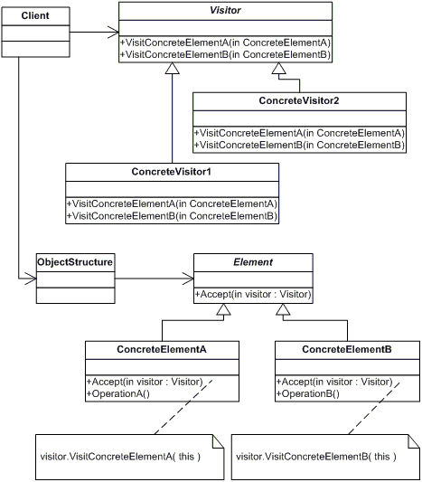

# Поведенчески шаблони ( Behavioral Patterns)

Три извесни шаблона за поведение на обекти в обектно ориентираните езици за програмиране са:

 *   Strategy Pattern
 *   Mediator Pattern
 *   Visitor Pattern
 *   State Pattern

## Strategy Pattern

Този шаблон се използва когато искаме да направим абстракция на алгоритъм. 
За целта си правим интерфейс който описва входните и изходните данни на всеки метод
в алгоритъма. Така в класа където използваме strategy-то разчитаме на абстракция и спазваме DIP
от SOLID принципите. Този шаблон се прилага когато имаме прекалено много if-else случаи в дадена логика. Тази логика може да се изнесе в strategy като всяка логика от if-else случаите се намира в отделен метов в отделен клас.

> ### Предимства:

* Прави кода лесен за тестване
* Логиката живее в отделни класове
* Добавянето на ново strategy е лесно.Спазва OCP от SOLID принципите


```cs

abstract class SortStrategy {
   public abstract void Sort(IList<object> list);
}

class QuickSort : SortStrategy {
   public override void Sort(IList<object> list) { ... }
}

class MergeSort : SortStrategy {
   public override void Sort(IList<object> list) { ... }
}

class SortedList {
   private IList<object> list = new List<object>();
   public void Sort(SortStrategy strategy) {
      // sortStrategy can be passed in constructor
      sortStrategy.Sort(list);
   }
}

```
##### See example StrategyPattern in Behavioral Patterns

## Mediator Pattern

Шаблона Mediator се грижи за комуникация между обектити. Имаме един централен обект който изпълнява цялата комуникациял Всички обекти които си комуникират знаят само за този междинен обект.Отделя се логиката на самите обекти от логиката чрез която комуникират с други обекти.
Шаблона се използва в случаите когато всеки трябва да знае за всеки.

> ### Предимсва

* Цялата логика на комуникация отива в Mediatora-а
* Участниците в комуникацията не знаят един за друг.


##### See example MediatorPattern in Behavioral Patterns

## Visitor Pattern

Целта на този шаблон е open/close принципа от SOLID принципите да се имплементира по подразбиране.
Visitor позволява да дефинираме операция в самия клас която може да се прилага върху неговата структурата. Когато правим дизайна на нашия клас решаваме че ще приемаме visitar-и на които ще подаваме някакви данни и те ще ни връщат резултат. Нашият клас съдържа метод който приема Visitor, подава му данни които той обработва и връща резултат който ние прилагаме някъде.
По този начин операциите които правим върху данните и самите данни са разкачени едни от други.
Можем лесно да подменяме функционалност в visitor-ите да им добавяме нова или да добавяме цели нови visitor-и. 

> ### Диаграма



> ### Пример:

```cs

public interface IVisitor {
  void Visit(PlainText docPart);
  void Visit(BoldText docPart);
  void Visit(Hyperlink docPart);
}

public class HtmlVisitor : IVisitor {
  public string Output { 
    get { return this.m_output; }
  }
  private string m_output = "";

  public void Visit(PlainText docPart) {
    this.Output += docPart.Text;
  }

  public void Visit(BoldText docPart) {
    this.m_output += "<b>" + docPart.Text + "</b>";
  }

  public void Visit(Hyperlink docPart) {
    this.m_output += "<a href=\"" + docPart.Url + "\">" + docPart.Text + "</a>";
  }
}

public abstract class DocumentPart {
  public string Text { get; private set; }
  public abstract void Accept(IVisitor visitor);
}

public class PlainText : DocumentPart { 
  public override void Accept(IVisitor visitor) {
    visitor.Visit(this);
  }
}

public class BoldText : DocumentPart { 
  public override void Accept(IVisitor visitor) {
    visitor.Visit(this);
  }
}

public class Hyperlink : DocumentPart {
  public string Url { get; private set; }

  public override void Accept(IVisitor visitor) {
    visitor.Visit(this);
  }
}

public class Document {
  private List<DocumentPart> m_parts;

  public void Accept(IVisitor visitor) {
    foreach (DocumentPart part in this.m_parts) {
      part.Accept(visitor);
    }
  }
}

```

##### See example VisitorPattern in Behavioral Patterns

## State Pattern

Когато поведението на даден обект трябва да бъде променено според състоянието се прилага state шаблона. Състоянеята се имплементират като отделни обекти, а преходите между отделните състояния се правят в самите състояния. Това което можем да правим в отделно състояние е метод в него.

- Предимство: Логиката на състоянието е енкапсулирана в самото състояние.
- Недостатък: Всяко състояне знае за друго състояние(силен coupling)


```cs

  abstract class State
  {
    public abstract void Handle(Context context);
  }

  class ConcreteStateA : State
  {
    public override void Handle(Context context)
    {
      context.State = new ConcreteStateB();
    }
  }

  class ConcreteStateB : State
  {
    public override void Handle(Context context)
    {
      context.State = new ConcreteStateA();
    }
  }

  class Context
  {
    private State _state;

    public Context(State state)
    {
      this.State = state;
    }

    public State State
    {

      get { return _state; }

      set
      {
        _state = value;

        Console.WriteLine("State: " + _state.GetType().Name);
      }
    }

    public void Request()

    {
      _state.Handle(this);
    }
  }
}

```
##### See example StatePattern in Behavioral Patterns