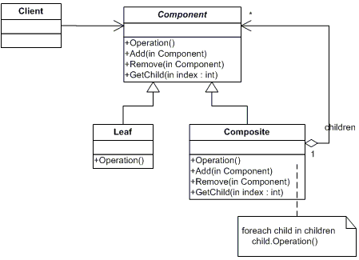

# Шаблони за структуриране на обекти ( Structural Patterns)

Три извесни шаблона за структуриранe на обекти в обектно ориентираните езици за програмиране са:

 *   Composite Pattern
 *   Flyweight Pattern
 *   Decorator Pattern

## Composite Pattern

Шаблона Composite Pattern  ни позволява да създаваме йерархия от класове.
Той ни позволява да комбинираме различни обекти в една дървовидна структура.
Чрез този шаблон можем да третираме обектите по един и същ начин без значение
дали тези обекти са прости или композитни(които съдържат други обекти).
Това позволява на композитните обекти да съдържат други композитни обекти или други
прости обекти.



Използва се когато искаме различни обекти които се наследяват едни други да ги третираме по един и същ начин.
> ### Получава се дървовидна структура.

### пример:


```cs
abstract class MailReceiver {
    public abstract void SendMail();
}


class EmailAddress : MailReceiver {
    public override void SendMail() { /*...*/ }
}

class GroupOfEmailAddresses : MailReceiver {
    private List<MailReceiver> participants;
    public override void SendMail() {
        foreach(var p in participants) p.SendMail();
    }
}
```
```sh
static void Main() {
    var rootGroup = new GroupOfEmailAddresses();
    rootGroup.SendMail();
}
```
##### See example CompositePattern in Structurial Patterns

## Flyweight Pattern

 Този шаблон се използва когато имаме много сходни обекти, като всеки обект заема
твърде много памет. Общите неща които съдържат тези обекти се изкарват в един Flyweight обект.
На този единствен обект в методите му подаваме като параметър разликите в различните обекти.
Така общата памет на всички обекти влиза като полета във Flyweight класа а различните данни
за всеки обект просто ги подаваме като параметри.Така се преизползва общата памет.

> Намаля количеството памет което ни е нужно.
> Пример от .NET е string.Intern()


##### See example FlyweightPattern in Structurial Patterns

## Decorator Pattern

Този шаблон ни позволява докато работи нашия код(runtime) да го обличаме(wrapp-ваме) в нов обект. По този начин можем да му добавяме нова функционалност или да заменяме стара такава.
Декоратор класа пази в себе си инстанция на оригиналния обект, като по този начин вместо с наследяване имаме достъп чрез инстанцията до функционалноста на обекта. Decorator-а приема в конструктора си инстанция на обекта който облича(wrapp-ва), като той е наследник и на същия тип който облича(wrapp-ва). 
Така всеки нов декоратор наследява базовия Декоратор и също приема инстанция на компонента и я подава на базовия.

- Предотвратява Class explosion 
-  Спазва Open/Close принципа от SOLID
- Можем да комбинираме всички декоратори в различни ситуации


### Diagram example:


##### See example DecoratorPattern in Structurial Patterns
